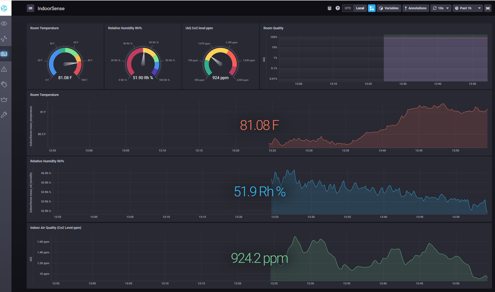

# ESP32-iAQ

IOT sensor application written in C/C++ for ESP32 microcontroller. Application integrated with I2C ENS210 and iAQ sensor to mesure temperature, relative humidity (RH%) and AirQuality (Co2 level), transmit InfluxDB time series database endpoint. 

# Hardware requirement
## Sensor

  

## ESP32 

  

# Wiring Diagram reference 

  

## ESP32 Connection with Sensor

  

# Visualization InfluxDB-Chronograf

InfluxDB and UI service running on Jetson Nano baord which collects data and write time series sensor values to local file system. Application can be wriiten to do further analytic process.   

## view 1

  

## View 2

  

## View 3 (with logs)

  

# Reference Datasheets

1. [AMS sensor](datasheets/ams_11032016_ENS210-1026005.pdf)
2. [AMS sensor circuite](datasheets/ams_Renesas_Sensor_Board_1v0.pdf)
3. [iAQ Sensor](datasheets/iAQ-core_DS000334_1-00-1512544.pdf)

# Install InflucDB on Jetson Nano

[InfluxDB/Chronograf](https://github.com/RaspiRepo/jetsonNano-Tick)